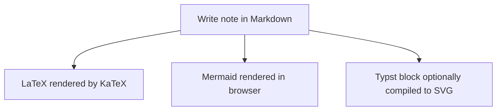

This starter keeps the site **very close to the feel of neil.computer**: text-forward, fast, mostly boxes and tables, and deployable as static files.

## What is included

- A homepage with a personal information box
- Dedicated **CV** and **Thesis** PDF links in that box
- A notes archive and individual note pages
- Markdown notes with inline math like $e^{i\pi} + 1 = 0$
- Display math such as

$$
\int_0^1 x^2\,dx = \frac{1}{3}
$$

- Mermaid diagrams
- Syntax-highlighted code blocks
- Optional Typst block rendering via precompiled SVG

```tip
This is the most robust low-infrastructure setup: GitHub Pages for hosting, browser-side Markdown + KaTeX for notes, and a tiny local script to compile Typst blocks to SVG when you need them.
```

## Mermaid example



## Code example

```python
def transfer_function(r, c, s):
    return 1 / (1 + r * c * s)
```

## Typst example

```typst
#set page(width: auto, height: auto, margin: 12pt)
#set text(size: 11pt)

$ sum_(k=1)^n k = (n(n+1))/2 $
```

The page will render a compiled SVG preview for Typst blocks **if** you run the helper script after installing the Typst CLI. Otherwise it shows the Typst source cleanly and tells you what command to run.

## Why this structure

A fully live in-browser Typst compiler is possible with typst.ts, but its own docs frame static SVG rendering as a strong option for websites, and the browser path is significantly heavier. This starter favors the smallest setup that still gives you nice results for technical notes.  
